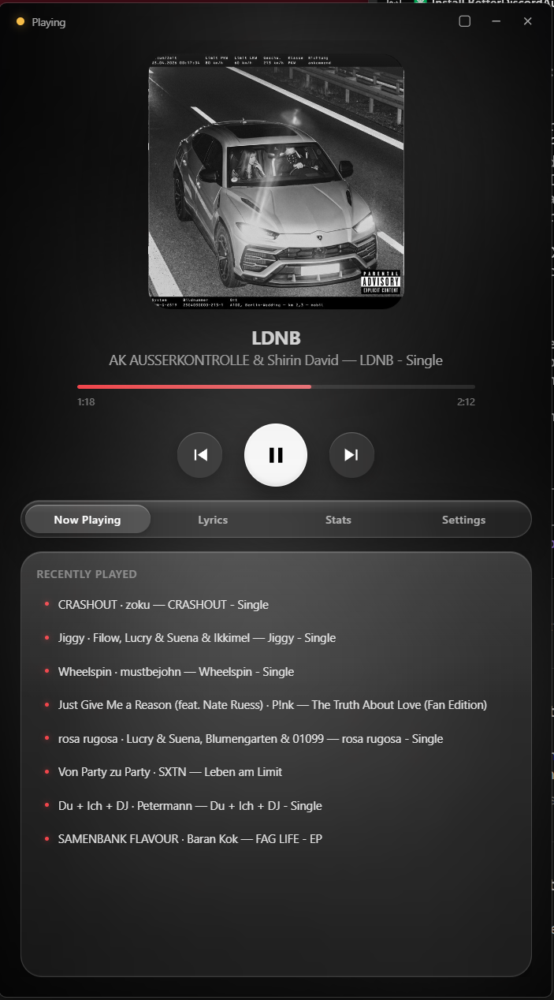
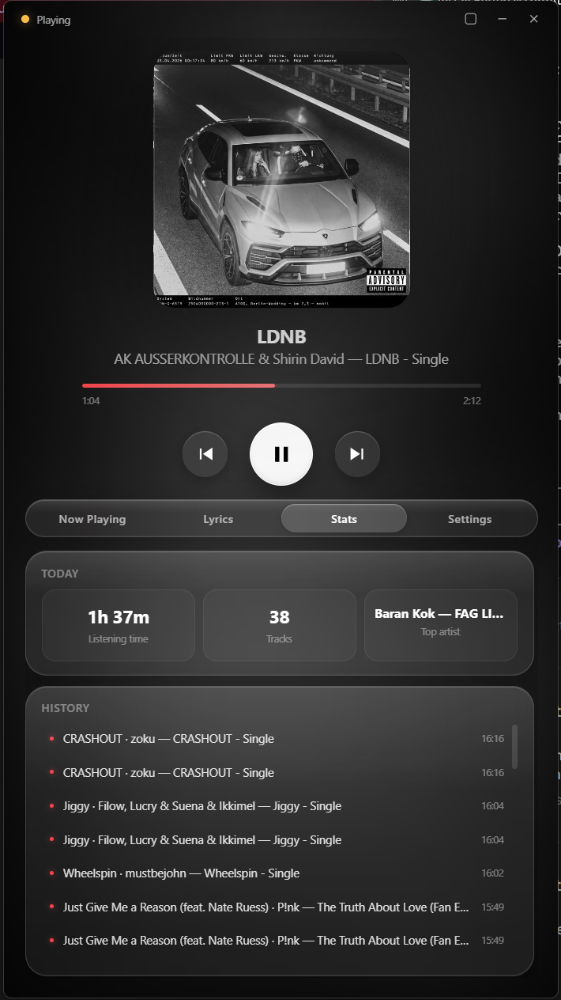
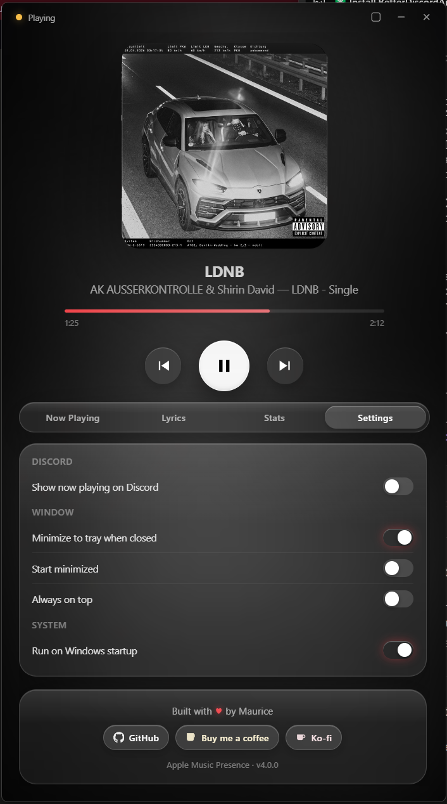
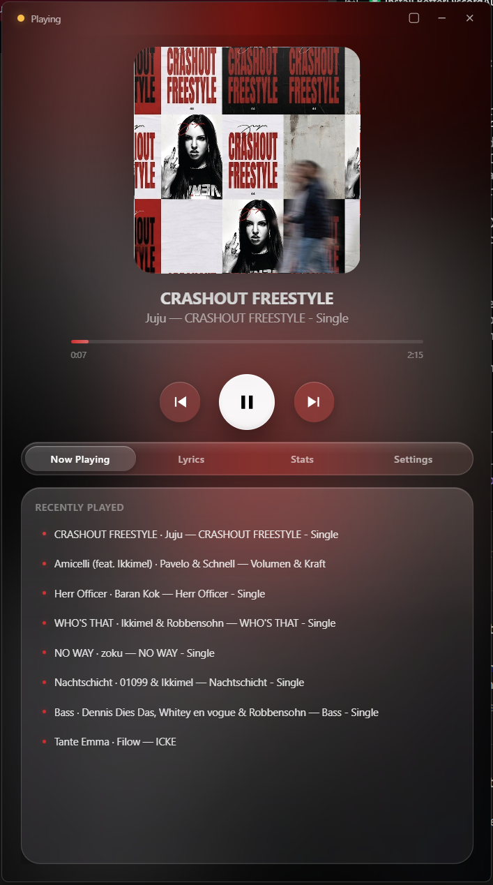
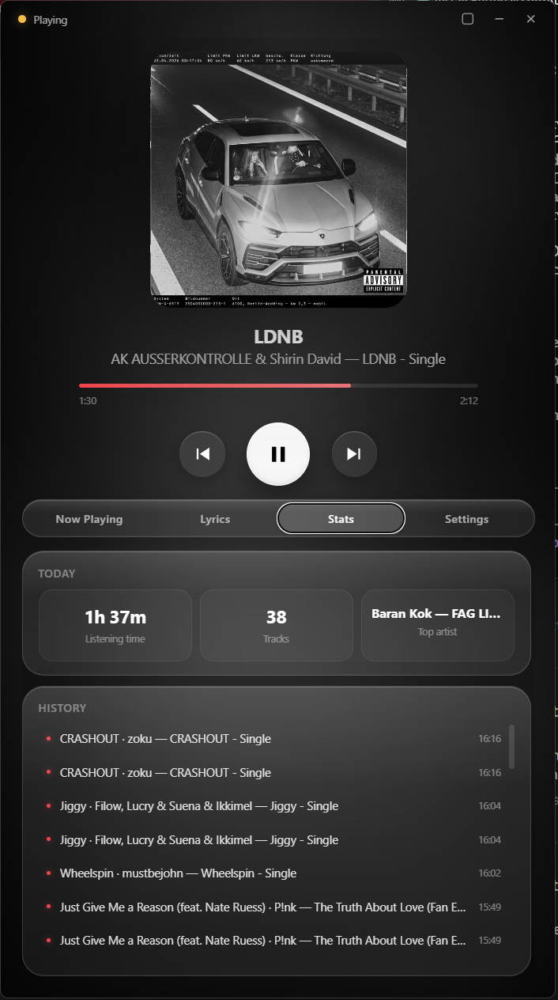
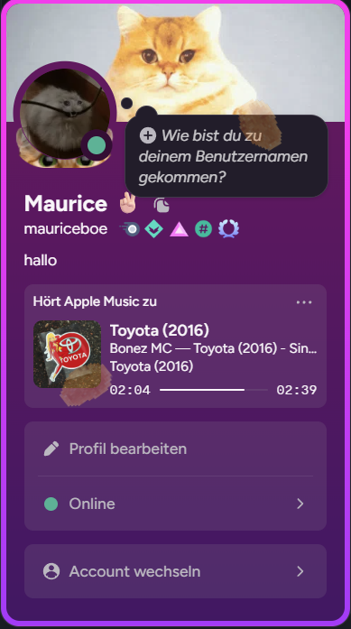
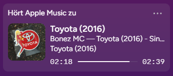

<div align="center">


# Tune

Discord Rich Presence for Apple Music on Windows — with synced lyrics, listening stats, and a Liquid Glass interface that mirrors the album you're playing.

<br />

<a href="https://github.com/mauriceboe/Tune/releases/latest"></a>
&nbsp;
<a href="https://github.com/mauriceboe/Tune/releases"></a>
<br />
<a href="https://ko-fi.com/mauriceboe"></a>
&nbsp;
<a href="https://www.buymeacoffee.com/mauriceboe"></a>
<br />
<a href="LICENSE"></a>
<a href="https://github.com/mauriceboe/Tune"></a>


</div>

---

<div align="center">
  <a href="docs/screenshots/now-playing.png"></a>
  <a href="docs/screenshots/stats.png"></a>
  <a href="docs/screenshots/settings.png"></a>
  <br />
  <a href="docs/screenshots/red.png"></a>
  <a href="docs/screenshots/stats-monochrome.png"></a>
</div>

<br />

<div align="center">

### On Discord

<a href="docs/screenshots/discord-profile.png"></a>
&nbsp;
<a href="docs/screenshots/discord-presence.png"></a>

</div>

---

## What you get

<table>
<tr>
<td width="50%" valign="top">

#### Discord

- **Live Rich Presence** — title, artist, album, progress bar, real cover art
- **"Listening to" status** — uses the Discord Listening activity type
- **Quick links** — `Search on YouTube` and `Search on Spotify` buttons next to your status
- **Real album covers** — uploaded once and cached, so Discord shows the exact art that's playing — not a guess from a search API

</td>
<td width="50%" valign="top">

#### Liquid Glass UI

- **Album-tinted backdrop** — full-window blurred cover art behind every screen
- **Dynamic accent** — progress bar, switches and highlights pull the dominant colour from the cover
- **Glass cards** — real `backdrop-filter` blur via Edge WebView2, not a fake gradient
- **Mini player** — toggleable compact mode for a corner of your screen

</td>
</tr>
<tr>
<td width="50%" valign="top">

#### Lyrics & history

- **Synced lyrics** — fetched from [LRCLIB](https://lrclib.net), highlighted in time, auto-scrolling
- **Per-day stats** — listening time, track count, top artist
- **History** — last 80 plays with timestamps
- **Recently played** — eight most-recent unique tracks at a glance

</td>
<td width="50%" valign="top">

#### Quality of life

- **One-click install** — first launch asks for confirmation, copies into `%LOCALAPPDATA%\Programs\Tune\`, creates a Start Menu shortcut, and registers under *Settings → Apps → Installed apps* so you can uninstall the regular Windows way
- **Auto-updates** — checks GitHub Releases in the background, downloads new builds, verifies the SHA-256, and swaps the EXE on next quit
- **System tray** — with play/pause, next, previous, an update item, and quick show/hide
- **Autostart** — optional Windows-startup launch
- **Always on top** — keep the player above other windows
- **Frameless + resizable** — drag any edge to resize

</td>
</tr>
</table>

<br />

## Get started in 30 seconds

1. **Download** the latest `Tune.exe` from [Releases](https://github.com/mauriceboe/Tune/releases/latest)
2. **Double-click** — Tune asks once whether to install, then copies itself into your user profile, pins a Start Menu entry, and registers under *Settings → Apps → Installed apps*
3. **Open Apple Music**, hit play, and watch your Discord status update

> No admin rights required. No Microsoft Store. From the next launch onward, Tune updates itself in the background — new releases on GitHub get downloaded, SHA-256 verified, and applied the next time you quit the app.

## Uninstall

Open *Settings → Apps → Installed apps* (or *Programs and Features* on Windows 10), pick **Tune**, and click *Uninstall*. Your settings, history and artwork cache in `%APPDATA%\Tune\` are kept; delete that folder by hand if you want them gone too.

<br />

## How it works

Tune doesn't talk to Apple Music directly — it reads the **Windows System Media Transport Controls (SMTC)** the same surface that powers the system volume overlay and the lock screen. Whatever Apple Music tells Windows it's playing, Tune sees:

- Title, artist, album, position, duration
- The actual album thumbnail rendered by Apple Music

Cover art is hashed and uploaded once to [catbox.moe](https://catbox.moe) so Discord can show the exact image. Each unique cover uploads only one time — subsequent plays of the same album hit the local cache.

Synced lyrics come from [LRCLIB](https://lrclib.net), a free community lyrics database — no API key, no account.

Auto-updates poll `api.github.com/repos/mauriceboe/Tune/releases/latest` every six hours. When a newer non-prerelease tag is found, Tune downloads `Tune.exe` and `Tune.exe.sha256` from that release, verifies the checksum, stages the new binary as `Tune.exe.new`, and writes a small batch script that swaps the files and relaunches once you quit. The check can be disabled in settings, and it never runs when you're developing from source.

<br />

## Tech stack

<div align="center">


</div>

The Python backend handles SMTC polling, Discord RPC, lyrics, history, and artwork hosting. The frontend is a single HTML/CSS/JS file rendered through Edge WebView2 — that's where the real liquid glass effects come from (`backdrop-filter`, `box-shadow`, dynamic CSS variables for the accent colour).

<br />

## Privacy

Tune runs locally and stores everything in `%APPDATA%\Tune\`:

- `settings.json` — your preferences
- `history.json` — your play history (never sent anywhere)
- `artwork_cache.json` — a `sha256 → catbox.moe url` map

The auto-updater fetches release metadata from GitHub (`api.github.com`) and downloads new builds from `github.com/mauriceboe/Tune/releases`. No identifiers other than a `User-Agent` of `Tune/<version>` are sent.

Data leaves your machine in only three cases, all triggered by playback:

- **Cover art** is uploaded to catbox.moe so Discord can display it. Each unique image is uploaded once.
- **Lyrics** are looked up at lrclib.net using the artist + title.
- **Discord Rich Presence** is sent to your local Discord client over an IPC socket.

Nothing is sent to a Tune server because there is no Tune server.

<br />

## Build from source

```powershell
python -m pip install -r requirements.txt
python -m PyInstaller --onefile --windowed --icon=icon.ico `
  --name Tune --collect-all winsdk --collect-all webview `
  --collect-all pystray --collect-all PIL `
  --add-data "web;web" --add-data "icon.ico;." app.py
```

The build drops a single `Tune.exe` (~43 MB) in `dist\`.

For local development without building:

```powershell
python app.py
```

<br />

## Configuration

Tune ships with a public Discord application ID so it works out of the box. To use your own:

1. Create an application at <https://discord.com/developers/applications>
2. Set environment variable: `setx TUNE_DISCORD_CLIENT_ID 1234567890`
3. Restart Tune

<br />

## Disclaimer

Tune is an unofficial third-party tool. It is not affiliated with, endorsed by, or sponsored by Apple Inc., Discord Inc., or LRCLIB. *Apple Music* is a trademark of Apple Inc.

<br />

## License

[MIT](LICENSE) — do whatever you want, just don't blame me if it breaks.
